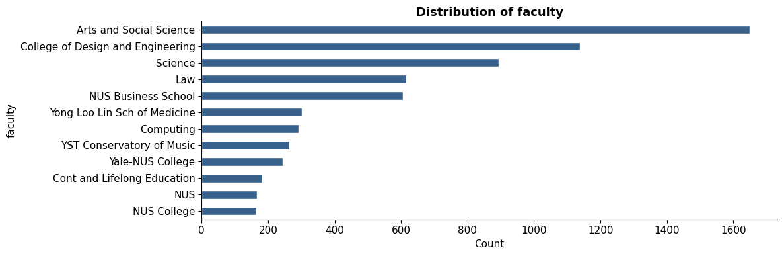
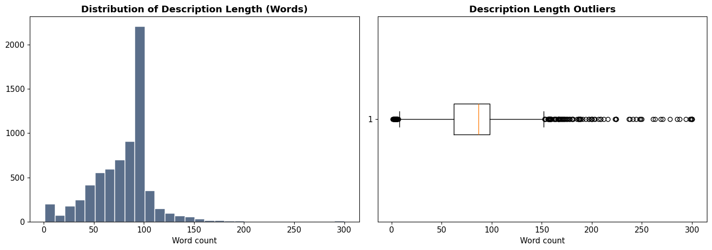
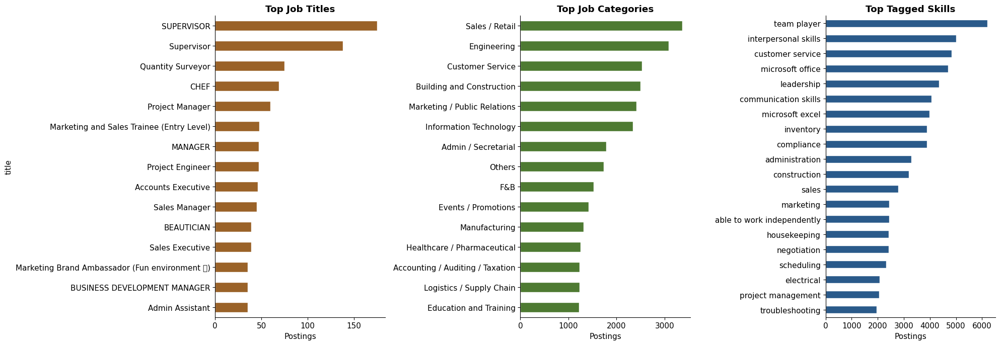
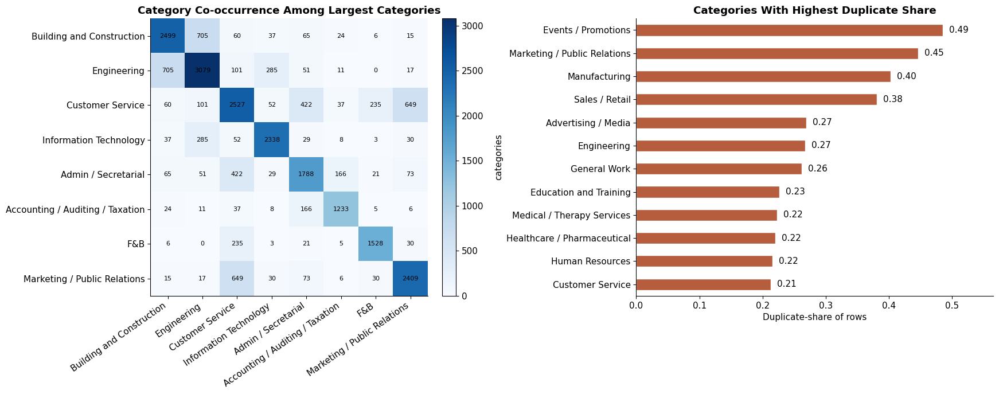
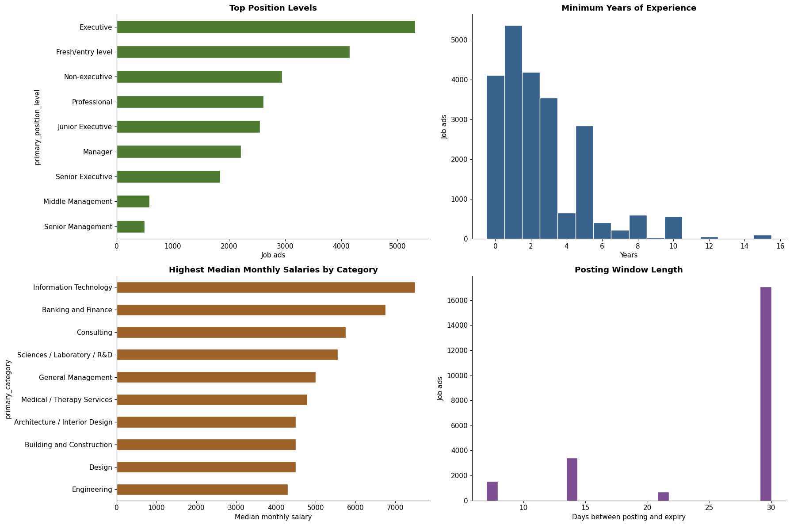

# Data

This section describes the datasets used and key preprocessing decisions. The goal is not only to ensure data quality, but to justify how the data supports a scalable and valid framework for curriculum–job alignment.

---

## Data Cleaning and Preprocessing

Refer to the Appendix on the detailed step list of the data cleaning.

### NUSMods 

Course data was retrieved from the NUSMods API and compiled into `modules.csv` (7,015 rows, 14 columns).

| Core Fields | Description |
|:---|:---|
| `moduleCode` | Unique identifier |
| `title` | Course title |
| `description` | Course description |
| `faculty` | Offering faculty |
| `prerequisite` | Required modules |
| `moduleCredit` | Credit units |

!!! info "Cleaning and Design Decisions"
    - **Missing descriptions (147 rows)** replaced with titles; experience-based modules excluded to reduce noise  
    - **Uniqueness enforced** via `moduleCode`  
    - **Level feature (`level_band`)** derived from module codes  

!!! note "Relevance to Framework"
    Module descriptions form the **primary semantic signal** for degree representations.  
    Removing experience-based modules ensures consistency and reduces noise in embedding-based matching.

---

### MyCareersFuture Job Ads

The dataset consists of 22,720 job postings, flattened from JSON into structured format.

| Core Fields | Description |
|:---|:---|
| `title` | Job title |
| `skills` | Required skills |
| `categories` | Job categories |
| `minimum_years_experience` | Experience required |
| `salary_min` / `salary_max` | Salary range |
| `posted_date` / `expiry_date` | Posting dates |
| `position_levels` | Seniority level |

!!! info "Cleaning and Design Decisions"
    - **Multi-label fields preserved as lists** (`skills`, `categories`, etc.)  
    - **Datetime conversion** for temporal fields  
    - **Feature engineering:**
        - `salary_mid`  
        - `posting_window_days`  
        - `primary_category`, `primary_position_level`  

!!! note "Relevance to Framework"
    Preserving multi-label structure enables **accurate skill matching and similarity computation**, avoiding information loss from flattening.

---

## Exploratory Data Analysis (EDA)

EDA identifies structural properties that directly inform modelling choices and potential sources of bias.

---

## NUSMods

### Distribution by Faculty

*Figure 1: Module representation is uneven, with FASS, CDE, and Science dominating the corpus.*

!!! tip "Implications for Framework"
    - Risk of **representation bias** in similarity-based matching  
    - Mitigation:
        - Construct **degree-specific module baskets** (≈15 core + 8 common modules)  
        - Use **length-normalised embeddings** to ensure fair comparison  

---

### Description Length

*Figure 2: Most descriptions fall within 60–100 words, with few long outliers (>250 words).*

!!! tip "Implications for Framework"
    Module descriptions provide sufficient semantic content for embeddings.  
    Text length is bounded during profile construction to control computational cost.

---

## MyCareersFuture Job Ads

### Market Breadth and Skills

*Figure 3: Soft skills (e.g., teamwork, communication) dominate in frequency across job postings.*

!!! tip "Implications for Framework"
    These skills are **non-discriminative** and introduce noise in similarity matching.  
    They are removed during preprocessing to improve signal quality.

---

### Category Co-occurrence

*Figure 4: Job categories frequently span multiple categories, reflecting overlapping functional roles.*

!!! tip "Implications for Framework"
    Categories are retained as structured features, enabling richer representation beyond plain text.

---

### Seniority and Experience

*Figure 5: Entry and junior roles dominate postings, but there still exist senior positions.*

!!! tip "Implications for Framework"
    - Aligns with **fresh graduate outcomes**  
    - Senior roles and internships are excluded to maintain relevance  

---

## Golden Test Set for Validation

While the dataset provides broad coverage (22,720 job postings and 7,015 modules),  
there is no layer for validation. 

!!! note "Next Step"
    Validation is addressed in subsequent sections through:
    - Human evaluation of job–course matches  
    - Coverage metrics (% of jobs and modules matched)  

    This ensures the framework is not only scalable, but also aligned with human judgement.

As such, we create a golden test set to evaluate the validity of matching. Refer to the Appendix for details on the golden test set.