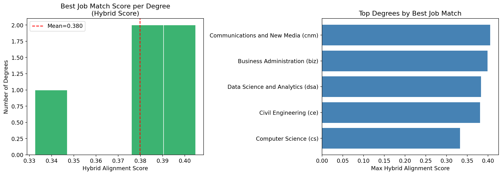
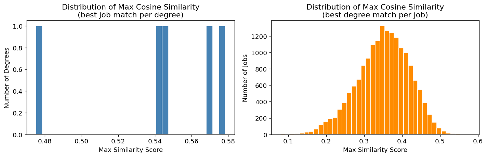

# Results

## Quantitative Comparison

The main finding is that richer retrieval methods outperform simple lexical matching, but the improvement is not uniform across all degrees. On the 190-pair gold set, cluster-routed semantic retrieval achieves the highest mean human-model agreement at 0.620, narrowly ahead of the hybrid semantic-plus-skill method at 0.615 and the plain semantic baseline at 0.603. Lexical TF-IDF is clearly the weakest overall method. This shows that curriculum-job alignment cannot be reduced to keyword overlap alone; semantic representation is needed to capture paraphrase, adjacent terminology, and broader role framing.

| Method | Mean human-model agreement | Mean Precision@5 |
| --- | ---: | ---: |
| Cluster-routed semantic | 0.620 | 1.00 |
| Hybrid semantic + skill | 0.615 | 1.00 |
| Semantic cosine | 0.603 | 0.92 |
| Skill coverage | 0.508 | 0.92 |
| Lexical TF-IDF | 0.419 | 0.80 |

Although cluster-routed semantic is best overall, the hybrid score is still attractive for operational use because it is easier to explain. In policy settings, a marginal performance gain is not always worth a large drop in interpretability. The hybrid method keeps a clear semantic component while also exposing whether the curriculum text explicitly covers employer-stated skills.

The degree-level breakdown reinforces this point. Civil Engineering is best served by the skill-coverage view, suggesting that employer language in that domain is relatively explicit and credential-driven. Communications and New Media performs best under lexical TF-IDF, which implies that shared vocabulary matters more in that field. Computer Science benefits most from cluster-routed semantic retrieval, consistent with the idea that software roles are described in many firm-specific ways and therefore gain from role-level grouping. No single method dominates for every degree, which is why the project compares several baselines instead of presenting one score as universally correct.

## Qualitative Alignment Patterns

The ranked results are substantively plausible. Business Administration retrieves finance and accounting roles such as Financial Accountant and Finance Controller. Civil Engineering retrieves Design Engineer and Civil & Structural Engineer roles. Communications and New Media surfaces marketing and corporate communication roles. Computer Science retrieves software engineering roles, while Data Science and Analytics retrieves data analyst, data engineer, and data scientist roles. These patterns suggest the framework is not merely matching generic language; it is recovering job families that are recognisably connected to the curriculum proxies.

At the same time, score magnitudes remain moderate rather than artificially extreme. The best hybrid scores fall roughly between 0.33 and 0.40 across the five degrees. This is a useful result in itself. It suggests that even strong matches represent partial alignment, which is realistic because a degree profile is broader than any single job ad and a job ad usually reflects employer-specific tooling, seniority requirements, and organisational context.

The figure above shows that the best-scoring degree-job matches cluster around a mean hybrid score of 0.380. Communications and New Media and Business Administration achieve the strongest best-match scores, while Computer Science is slightly lower. This should not be read as a claim that Computer Science is less valuable. A more careful interpretation is that software jobs often contain narrower tool stacks and employer-specific requirements, which can reduce direct textual overlap even when the programme is clearly relevant.

The cosine-similarity distributions provide a second diagnostic. The job-to-degree distribution is centred well below 0.5, which indicates that most jobs are not close matches to any one degree proxy. For policy purposes, this is desirable. If every job looked highly aligned to every degree, the framework would have little discriminatory value. Instead, the distribution suggests a usable middle ground: enough spread to distinguish stronger from weaker matches, but not so much concentration that the system simply memorises obvious keywords.

## Interpretation For Policy Use

Two conclusions follow. First, curriculum-job alignment should be reported as a portfolio of evidence rather than a single ranking. Combining semantic, skill-based, and cluster-based views gives stakeholders a fuller picture of why a match appears credible. Second, the framework is most useful as a monitoring tool. It can help MOE or university reviewers identify areas for closer inspection, but it should sit alongside graduate outcomes, employer consultation, and academic judgement.

## Limitations, Biases, And Ethical Considerations

Several limitations matter for responsible use. The job corpus covers only one week of postings, so short-term hiring spikes may influence apparent alignment. The degree proxies are curated rather than exhaustive, which improves control but may omit specialised electives. The gold set is an internal human-labelled proxy set rather than an external benchmark, so performance numbers should be interpreted as validation evidence, not a final claim of generalisability. There is also unavoidable platform bias: MyCareersFuture reflects the jobs posted there, not the entire labour market.

There are ethical implications as well. A system like this could be misused to penalise programmes that serve broader social or intellectual goals. To avoid that, the report frames alignment as one input into curriculum review rather than a replacement for expert judgement. The scope filters also embody a policy choice: excluding internships, academia, and very senior leadership roles keeps the comparison focused, but different policy questions may require different inclusion rules. Future work should therefore add time-series monitoring, broader university coverage, and a larger independently annotated evaluation set.
