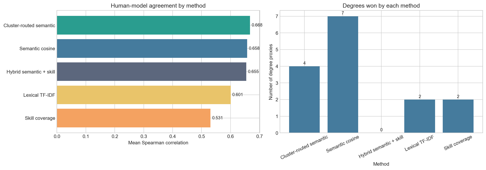

# Results

## Quantitative Comparison

The latest evaluation is broader and stronger than the earlier report draft. It now covers 15 degree proxies and 616 labelled degree-job pairs. On this benchmark, cluster-routed semantic retrieval achieves the best overall human-model agreement at 0.668, followed by semantic cosine at 0.658 and the hybrid semantic-plus-skill method at 0.655. Lexical TF-IDF remains the weakest overall method, but it is still competitive in some domains, which shows that domain vocabulary continues to matter even after stronger semantic models are introduced.

| Method | Mean human-model agreement | Mean Precision@5 |
| --- | ---: | ---: |
| Cluster-routed semantic | 0.668 | 1.00 |
| Semantic cosine | 0.658 | 0.973 |
| Hybrid semantic + skill | 0.655 | 1.00 |
| Lexical TF-IDF | 0.601 | 0.947 |
| Skill coverage | 0.531 | 0.973 |

One important detail is that top-k precision is close to ceiling for the strongest methods. Cluster-routed semantic and hybrid both achieve perfect `Precision@5`, while semantic cosine is only slightly lower. This means ranking agreement is the more informative discriminator. In other words, the key question is not whether the methods can place some good jobs near the top; it is whether they order the candidates in a way that matches human judgement consistently across disciplines.

The method comparison also shows that no single approach dominates every degree. Semantic cosine is best for 7 of the 15 degree proxies, cluster-routed semantic is best for 4, lexical TF-IDF for 2, and skill coverage for 2. The hybrid method is close to the leaders but does not top any degree by agreement. This pattern is useful rather than disappointing: it suggests the framework is sensitive to real differences in labour-market language. Technical roles with many firm-specific descriptions benefit from clustering, while some programmes are still well served by simple shared vocabulary or explicit skill tags.

The left panel shows that cluster-routed semantic has the best overall agreement, but the margin over semantic cosine and hybrid is small. The right panel shows why a portfolio view is preferable in policy use: different methods win in different degree families. For the interactive app, the hybrid score remains useful because it gives slightly less accuracy than the top offline method but clearer explanations through its semantic and skill components.

## Qualitative Alignment Patterns

The ranked results remain substantively plausible across very different disciplines. Accounting retrieves audit and accountant roles, Business Administration retrieves finance-controller and finance-analyst roles, Data Science and Analytics surfaces data scientist and data engineer roles, and Pharmacy retrieves pharmacy technician and pharmacist roles. This matters because the method is being asked to handle both highly vocational programmes and broader interdisciplinary ones within the same pipeline.

There are also useful edge cases. Architecture produces a sensible architecture-specific match, but also surfaces adjacent built-environment and project-engineering roles. History shows lower and more diffuse matches than professionally regulated programmes. These cases support a more careful policy reading: high alignment is easier to establish for programmes with clear occupational pipelines, while broad-based degrees produce noisier but still interpretable labour-market signals.

| Degree proxy | Representative top match | Why it is useful |
| --- | --- | --- |
| Accounting | Audit Assistant | Strong direct occupational pipeline |
| Architecture | Senior Architect / Assistant Project Engineer | Captures both core and adjacent built-environment roles |
| Data Science and Analytics | Data Scientist | Reflects explicit analytics and modelling demand |
| Pharmacy | Pharmacy Technician / Pharmacist | Shows strong alignment in a tightly regulated domain |

## Interpretation For Policy Use

Two conclusions follow. First, curriculum-job alignment should be reported as a portfolio of evidence rather than a single ranking. Combining semantic, skill-based, and cluster-based views gives stakeholders a fuller picture of why a match appears credible. Second, the framework is most useful as a monitoring tool. It can help MOE or university reviewers identify areas for closer inspection, but it should sit alongside graduate outcomes, employer consultation, and academic judgement.

## Limitations, Biases, And Ethical Considerations

Several limitations matter for responsible use. The job corpus still covers only one week of postings, so short-term hiring spikes may influence apparent alignment. The degree proxies are curated rather than exhaustive, which improves control but may omit specialised electives. The gold set is internal and label-imbalanced toward Relevant pairs, which helps explain the very high precision scores; the benchmark is therefore useful, but not yet definitive. There is also unavoidable platform bias: MyCareersFuture reflects the jobs posted there, not the entire labour market.

There are ethical implications as well. A system like this could be misused to penalise programmes that serve broader social or intellectual goals. To avoid that, the report frames alignment as one input into curriculum review rather than a replacement for expert judgement. The scope filters also embody a policy choice: excluding internships, academia, and very senior leadership roles keeps the comparison focused, but different policy questions may require different inclusion rules. Future work should add time-series monitoring, broader university coverage, and a larger independently annotated benchmark.
